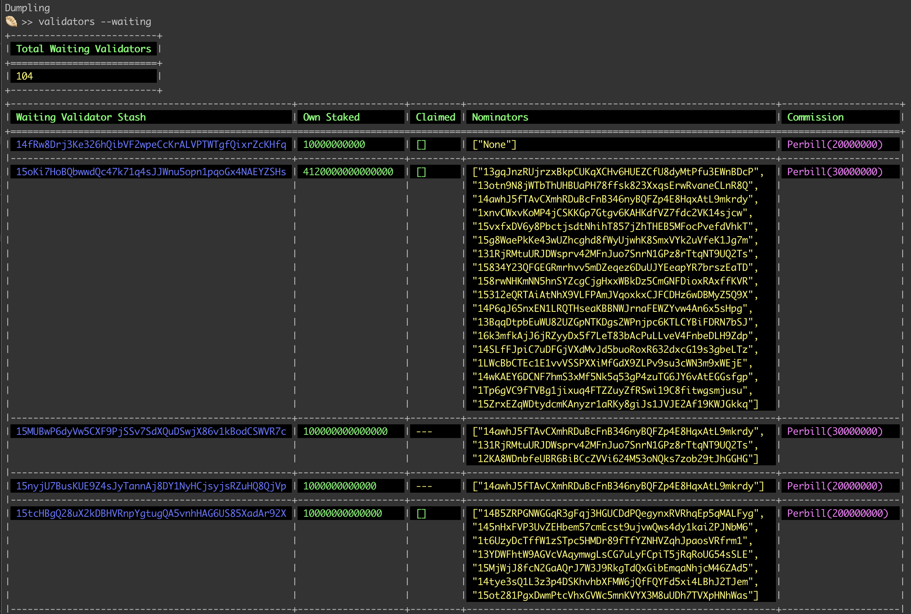

# dumpling

## What is dumpling?

***dumpling*** is a command line interface tool designed for polkadot network validators. In the current PoA phase of Polkadot, ***dumpling*** provides useful information for validators on the state of the network. 
***dumpling*** currently has 3 subcommands.

`pulse` - for time dependent useful state information
```
useful state information

USAGE:
    pulse [FLAGS]

FLAGS:
    -a, --activeEra       Active Era
    -b, --block           Current finalised block
    -h, --help            Prints help information
    -c, --plannedEra      Current Era (planned)
    -s, --sessionIndex    Current session index
    -V, --version         Prints version information

```

`validators` - for current validator lists
```
lists of validators and their information

USAGE:
    validators [FLAGS] [OPTIONS]

FLAGS:
    -h, --help       Prints help information
    -q, --queued     Queued validators with nominators' exposures and own exposure
    -s, --session    Session validators
    -V, --version    Prints version information
    -w, --waiting    Waiting validators with their stakes, nominators, ledger and preferences

OPTIONS:
    -a, --account <accountId>    Get waiting validator by accountId
```

`nominators` - for current nominator list
```
list of nominators with their stakes, nomination details

USAGE:
    nominators [OPTIONS]

FLAGS:
    -h, --help       Prints help information
    -V, --version    Prints version information

OPTIONS:
    -a, --account <accountId>    Get nominator by accountId
```
___
## Usage

#### Node
This tool currently works with Polkadot: v0.8.1

#### CLI
1. Clone this repo
1. Cargo build --release
1. `./target/release/dumpling` to enter the mini terminal

#### Example - validators:

In the dumpling terminal: 
`🥟 >> validators --waiting`


#### Example - nominators:

In the dumpling terminal: 
`🥟 >> nominators --account=15312eQRTAiAtNhX9VLFPAmJVqoxkxCJFCDHz6wDBMyZ5Q9X`


#### Lib
You can also use this project as a library for your project in rust or other native modules.

#### Limitations

Due to the limited time for this challenge, currently this project works with a *_forked_* version of [substrate-api-client](https://github.com/scs/substrate-api-client). Changes made in this fork are:
- added `get_key_prefix` method and `get_keys` in the rpc client (Update [PR](https://github.com/scs/substrate-api-client/pull/95) merged)
- removed requirement for default value for `get_storage_map` *(hack!)*

***dumpling*** will collaborate with ***substrate-api-client*** to get the best solution for both projects.

___

#### Brief for challenge 2
Command-line Polkadot API interaction: 

- JS API interaction: Provide an easy interaction to write JavaScript code which interacts with a node. 

- Command-line Polkadot API interaction: Create a way to send different extrinsics from the command line to do different tasks – like seeing the current block height, list of validators, extrinsics in last block, etc. 

- Tools to help validators: Validators will be signaling their intention to nominate in the initial PoA phase. It would be great to have tools made specifically for them, such as seeing how much stake is behind others who have signaled their intention to validate.


